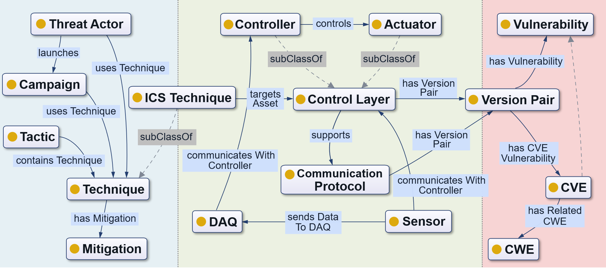

# Tr**ICS** Ontology

Tr**ICS** Ontology is a cross-domain ontology for Industrial Control System (ICS) threat intelligence. It provides a unified semantic model for representing cyber threats, vulnerabilities, industrial assets, and cross-domain relations between IT-side threat intelligence and OT-side physical assets.

The ontology is designed to support ICS threat intelligence knowledge graph construction (including ontology-guided information extraction, graph fusion and completion pipelines) and graph-based threat analysis.

Representative core schema of the ontology is shown as follows:

  <em>Figure 1: <a href="figures/core_ontology.pdf">Representative core schema of the ontology</a>.</em>

## Ontology resources

- Canonical IRI: <https://w3id.org/trics/ontology>
- Current version: `0.2.0`
- Documentation: <https://llleafgod.github.io/trics/>
- WebVOWL visualization: <https://llleafgod.github.io/trics/webvowl/>
- Source ontology: [`ontology/trics.ttl`](ontology/trics.ttl)
- RDF/XML serialization: [`ontology/trics.rdf`](ontology/trics.rdf)
